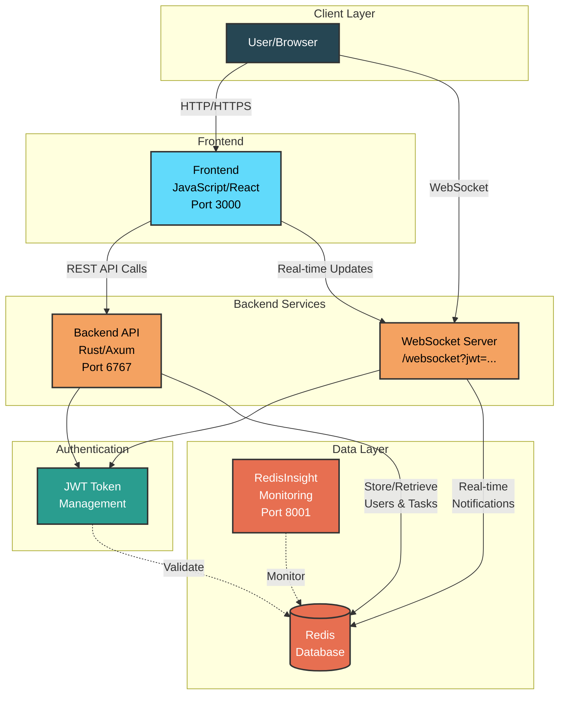

# Task Tracker

## Deployment

**Don't forget to change `JWT_SECRET` in `.env`!!!**

This may require root access, depending on your Docker configuration

```sh
docker compose up -d # Build and start the containers
docker compose logs -f # View the logs
docker compose down -v # Stop and remove everything including volumes
```

- Frontend runs on `http://localhost:3000`
- RedisInsight runs on `http://localhost:8001`

## Environment variables (in `.env`)

- `REDIS_URL`: Redis URL, defaults to `redis://127.0.0.1:6379`
- `BACKEND_URL`: The router will listen on this URL, defaults to `0.0.0.0:6767`
- `FRONTEND_URL`: The frontend will run on this URL, defaults to `127.0.0.1:3000`
- `JWT_SECRET`: Self-explanatory

## Diagram



## WebSocket Endpoint

**Connect on:** `ws://localhost:6767/websocket?jwt=...`

### Send messages

- Text:
    ```json
    {"type": "refresh_jwt", "jwt": <string>}
    ```
- PING

### Receive messages

- Text:
    ```json
    {"type": "error", "message": <string>}
    {
      "type": "task_created",
      "task": {
        "id": <uuid string>,
        "category": <string>,
        "title": <string>,
        "text": <string>,
        "completed": <bool>,
        "due": <int | null>
      }
    }
    {
      "type": "task_updated",
      "task": {
        "id": <uuid string>,
        "category": <string>,
        "title": <string>,
        "text": <string>,
        "completed": <bool>,
        "due": <int | null>
      }
    }
    {"type": "task_deleted", "task_id": <uuid string>}
    ```
- PONG

## Authentication Endpoints

### POST `/auth/register`

Register a new user

#### Request Payload

- Type: JSON
- Structure:
    ```json
    {
      "username": <string>,
      "password": <string>
    }
    ```

#### Response Payloads

- HTTP 200 (OK):
    - Type: JSON
    - Structure:
        ```json
        {
          "jwt": <string>
        }
        ```
- HTTP 409 (CONFLICT): `<error string>`
- HTTP 500 (INTERNAL SERVER ERROR): `<error string>`

### POST `/auth/login`

Login with username/password or refresh with JWT

#### Request Payload

- Type: JSON
- Structure (Option 1 - Username/Password):
    ```json
    {
      "username": <string>,
      "password": <string>
    }
    ```
- Structure (Option 2 - JWT Refresh):
    ```json
    {
      "jwt": <string>
    }
    ```

#### Response Payloads

- HTTP 200 (OK):
    - Type: JSON
    - Structure:
        ```json
        {
          "jwt": <string>,
          "username": <string>
        }
        ```
- HTTP 400 (BAD REQUEST): `<error string>`
- HTTP 401 (UNAUTHORIZED): `<error string>`
- HTTP 500 (INTERNAL SERVER ERROR): `<error string>`

### POST `/auth/logout`

Logout and revoke JWT

#### Request Payload

- Type: JSON
- Structure:
    ```json
    {
      "jwt": <string>
    }
    ```

#### Response Payloads

- HTTP 200 (OK): No content
- HTTP 401 (UNAUTHORIZED): `<error string>`
- HTTP 500 (INTERNAL SERVER ERROR): `<error string>`

## Task Endpoints

### GET `/task`

Get all tasks for authenticated user

#### Request Payload

- Type: JSON
- Structure:
    ```json
    {
      "jwt": <string>
    }
    ```

#### Response Payloads

- HTTP 200 (OK):
    - Type: JSON
    - Structure:
        ```json
        [
          {
            "id": <uuid string>,
            "category": <string>,
            "title": <string>,
            "text": <string>,
            "completed": <bool>,
            "due": <int | null>
          }
        ]
        ```
    - Note: `due` is a UNIX timestamp or null
- HTTP 401 (UNAUTHORIZED): `<error string>`
- HTTP 500 (INTERNAL SERVER ERROR): `<error string>`

### POST `/task`

Create a new task

#### Request Payload

- Type: JSON
- Structure:
    ```json
    {
      "jwt": <string>,
      "category": <string>,
      "title": <string>,
      "text": <string>,
      "completed": <bool>,
      "due": <int | null>
    }
    ```
- Note: `due` is a UNIX timestamp or null

#### Response Payloads

- HTTP 201 (CREATED): No content
- HTTP 401 (UNAUTHORIZED): `<error string>`
- HTTP 500 (INTERNAL SERVER ERROR): `<error string>`

### GET `/task/{id}`

Get a specific task by ID

#### Path Parameters

- `id`: <uuid string> - The task ID

#### Request Payload

- Type: JSON
- Structure:
    ```json
    {
      "jwt": <string>
    }
    ```

#### Response Payloads

- HTTP 200 (OK):
    - Type: JSON
    - Structure:
        ```json
        {
          "id": <uuid string>,
          "category": <string>,
          "title": <string>,
          "text": <string>,
          "completed": <bool>,
          "due": <int | null>
        }
        ```
    - Note: `due` is a UNIX timestamp or null
- HTTP 401 (UNAUTHORIZED): `<error string>`
- HTTP 404 (NOT FOUND): `<error string>`
- HTTP 500 (INTERNAL SERVER ERROR): `<error string>`

### POST `/task/{id}`

Update an existing task

#### Path Parameters

- `id`: <uuid string> - The task ID

#### Request Payload

- Type: JSON
- Structure:
    ```json
    {
      "jwt": <string>,
      "category": <string | null>,
      "title": <string | null>,
      "text": <string | null>,
      "completed": <bool | null>,
      "due": <int | null>
    }
    ```
- Note: All fields except `jwt` are optional. Only provided fields will be updated.
- Note: `due` is a UNIX timestamp or null

#### Response Payloads

- HTTP 200 (OK): No content
- HTTP 401 (UNAUTHORIZED): `<error string>`
- HTTP 404 (NOT FOUND): `<error string>`
- HTTP 500 (INTERNAL SERVER ERROR): `<error string>`

### DELETE `/task/{id}`

Delete a task

#### Path Parameters

- `id`: <uuid string> - The task ID

#### Request Payload

- Type: JSON
- Structure:
    ```json
    {
      "jwt": <string>
    }
    ```

#### Response Payloads

- HTTP 200 (OK): No content
- HTTP 401 (UNAUTHORIZED): `<error string>`
- HTTP 404 (NOT FOUND): `<error string>`
- HTTP 500 (INTERNAL SERVER ERROR): `<error string>`
